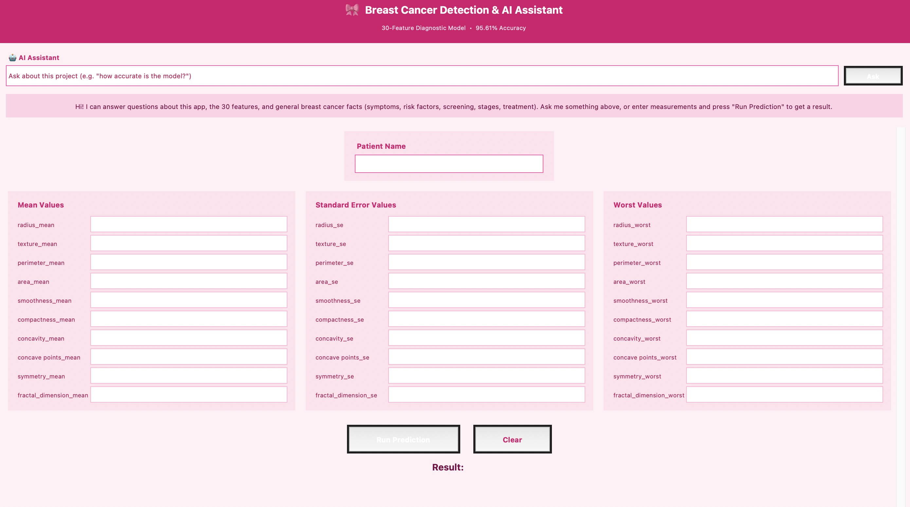
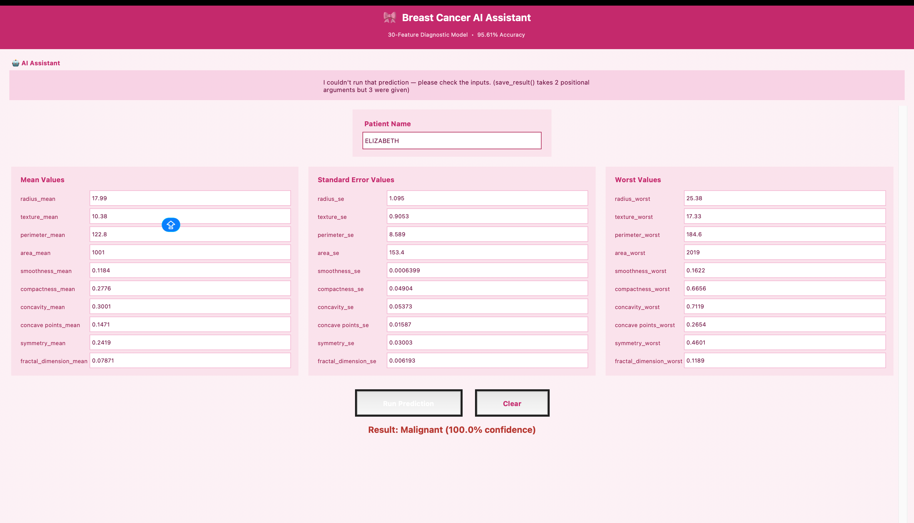
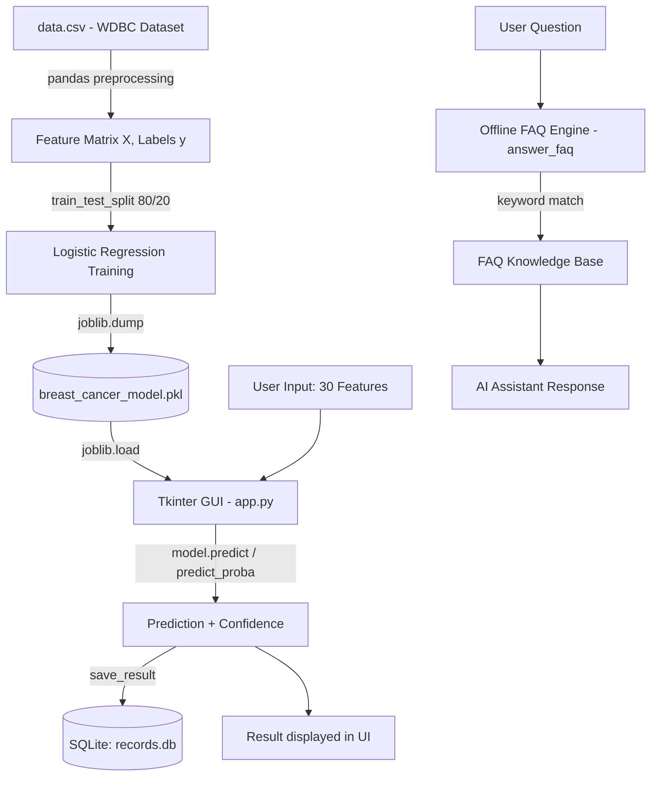

# 🎀 Breast Cancer AI Assistant

**A machine learning–powered diagnostic support tool with a conversational AI assistant, built end-to-end in Python.**

[](https://www.python.org/)
[](https://scikit-learn.org/)
[](https://docs.python.org/3/library/tkinter.html)
[](https://www.sqlite.org/)
[](#-license)

---

## 📖 Overview

The **Breast Cancer AI Assistant** is a desktop application that predicts whether a breast tumor is **Benign** or **Malignant** from 30 quantitative measurements of cell nuclei, using a **Logistic Regression** classifier trained on the Wisconsin Diagnostic Breast Cancer (WDBC) dataset. It reaches **95.61% test accuracy** and wraps the model in a friendly, guided GUI — complete with a built-in, offline **AI assistant** that answers questions about the project, every one of the 30 clinical features, and general breast cancer education, all without any external API calls.

This project was built to demonstrate the **full ML product lifecycle**: data preprocessing → model training/evaluation → persistence → an interactive front end → local data storage — the same pipeline shape used in real clinical decision-support and health-tech tools.

> ⚠️ **Disclaimer:** This is a machine learning demo built for educational and portfolio purposes. It is **not** a certified medical device and must never be used as a substitute for professional diagnosis. Always consult a qualified healthcare provider.

---

## 🖼️ Screenshots

| Data Entry Form | Prediction Result |
|:---:|:---:|
|  |  |
| *Patient info + 30 features organized into Mean / SE / Worst columns* | *Model output with confidence score, saved to the local database* |

---

## ✨ Key Features

- 🔬 **30-feature ML classifier** — Logistic Regression trained on all mean, standard-error, and "worst" measurements of cell nuclei (radius, texture, perimeter, area, smoothness, compactness, concavity, concave points, symmetry, fractal dimension).
- 🎯 **95.61% accuracy** on a held-out 20% test split, with prediction confidence surfaced via `predict_proba()`.
- 🤖 **Offline AI Assistant** — a keyword-matched Q&A engine that can explain:
  - What the app does and how to use it
  - Every one of the 30 individual features, in plain language
  - General breast cancer education: symptoms, risk factors, screening, staging, treatment overview, benign vs. malignant tumors
  - All fully local — **zero network calls, zero API keys, zero data leaves the machine.**
- 🖥️ **Purpose-built desktop GUI** (Tkinter) — a responsive, scrollable, three-column layout that groups the 30 inputs logically and scales to the window size.
- 💾 **Persistent record-keeping** — every prediction (patient name, result, confidence, timestamp) is saved to a local **SQLite** database for auditability and history.
- 🎨 **Custom themed UI** — a cohesive pink visual identity appropriate to the subject matter, built entirely with native Tkinter widgets (no external UI framework).

---

## 🏗️ Architecture



**Design principles:**
- **Separation of concerns** — model training (`model.py`), data persistence (`database.py`), and presentation (`app.py`) are fully decoupled modules.
- **Reproducibility** — the trained model is serialized with `joblib`, so training and inference are independent steps.
- **Privacy by design** — the assistant answers from a static local knowledge base, so no patient data or questions are ever transmitted externally.

---

## 🧠 Model Details

| Aspect | Detail |
|---|---|
| **Algorithm** | Logistic Regression (`scikit-learn`, `max_iter=10000`) |
| **Dataset** | Wisconsin Diagnostic Breast Cancer (WDBC) — 569 samples, 30 features |
| **Features** | 10 base measurements × 3 statistics each (mean, standard error, worst) |
| **Train/Test Split** | 80% / 20%, `random_state=42` |
| **Accuracy** | **95.61%** on held-out test data |
| **Output** | Binary classification (Benign / Malignant) + probability-based confidence |
| **Serialization** | `joblib` (`breast_cancer_model.pkl`) |

### The 30 Features at a Glance
Each of these 10 cell-nuclei characteristics is captured three ways — as a **mean**, a **standard error**, and a **worst (most extreme)** value — for a total of 30 inputs:

`radius` · `texture` · `perimeter` · `area` · `smoothness` · `compactness` · `concavity` · `concave points` · `symmetry` · `fractal dimension`

The built-in AI Assistant can explain any of these 30 individually in plain English on request.

---

## 🛠️ Tech Stack

| Layer | Technology |
|---|---|
| Language | Python 3.9+ |
| Machine Learning | scikit-learn, pandas, numpy |
| Model Persistence | joblib |
| GUI Framework | Tkinter (native, no external UI dependencies) |
| Database | SQLite3 |
| AI Assistant | Custom offline keyword-matching engine (no external LLM/API) |

---

## 📂 Project Structure

```
breast_cancer_app/
├── app.py                    # Tkinter GUI + prediction logic + AI assistant
├── model.py                  # Model training pipeline
├── database.py               # SQLite persistence layer
├── breast_cancer_model.pkl   # Trained model artifact (generated by model.py)
├── data.csv                  # WDBC training dataset (not included — see setup)
├── records.db                # Local prediction history (auto-created)
└── screenshots/               # README assets
```

---

## 🚀 Getting Started

### Prerequisites
```bash
pip install pandas scikit-learn joblib
```
Tkinter and sqlite3 ship with standard Python installations.

### 1. Train the model
Place the WDBC dataset as `data.csv` in the project root, then run:
```bash
python model.py
```
This prints the test accuracy and saves `breast_cancer_model.pkl`.

### 2. Launch the app
```bash
python app.py
```

### 3. Use it
1. Ask the **AI Assistant** anything about the project, a feature, or breast cancer in general.
2. Enter a patient name and the 30 measurements (or use sample values from the dataset).
3. Click **Run Prediction** to get a Benign/Malignant result with a confidence score.
4. Every prediction is automatically saved to `records.db`.

---

## 🌍 Real-World Applications

While this project is a portfolio/educational build, the same architecture pattern maps directly onto real health-tech use cases:

- **Clinical decision-support prototyping** — a lightweight second-opinion tool that pathologists or radiologists could reference alongside imaging analysis software.
- **Telemedicine & rural healthcare triage** — offline-capable screening tools are valuable where internet connectivity or specialist access is limited.
- **Medical education** — a hands-on way for students to see how quantitative cytological features (from tools like fine-needle aspiration biopsies) translate into diagnostic signals.
- **Health-tech MVP scaffolding** — the modular model/database/UI separation is the same shape used to bootstrap real diagnostic SaaS products before scaling to cloud infrastructure.
- **Research & benchmarking** — a baseline for comparing classical ML (Logistic Regression) against more complex models (SVM, Random Forest, neural nets) on the same clinical dataset.

---

## 🔮 Future Enhancements

- [ ] **Model upgrades** — benchmark against Random Forest, XGBoost, and a simple neural network; add cross-validation and hyperparameter tuning (GridSearchCV/Optuna).
- [ ] **Explainability** — integrate SHAP or LIME to show *which* features drove a specific prediction, critical for clinical trust.
- [ ] **Image-based input** — extend beyond manual numeric entry to accept histopathology images and extract features automatically via computer vision.
- [ ] **Web & mobile deployment** — rebuild the front end in React/Flask or FastAPI so the model is accessible via browser or mobile app, not just desktop.
- [ ] **Cloud-hosted API** — expose the model as a REST endpoint (FastAPI + Docker) for integration into larger hospital or EHR systems (HL7/FHIR compatible).
- [ ] **Smarter AI Assistant** — optionally connect the assistant to a real LLM (e.g., via the Anthropic API) for open-ended Q&A, while keeping the offline FAQ as a privacy-preserving fallback.
- [ ] **Multi-user support & authentication** — role-based access for clinicians vs. administrators, with audit logging.
- [ ] **Analytics dashboard** — visualize prediction history, trends, and model performance drift over time from `records.db`.
- [ ] **Automated testing & CI/CD** — unit tests for the model pipeline and UI logic, plus a GitHub Actions workflow for linting and testing on every push.
- [ ] **Data validation layer** — enforce realistic input ranges per feature and flag out-of-distribution inputs before prediction.

---

## ⚠️ Limitations & Ethical Considerations

- This tool is trained on a single, relatively small public dataset (569 samples) and has not been clinically validated.
- Logistic Regression assumes linear decision boundaries, which may not capture all real-world tumor complexity.
- The tool should **never** be used for actual patient diagnosis or treatment decisions.
- As with any ML system in healthcare, deploying a real version would require rigorous clinical validation, regulatory review (e.g., FDA/CE marking), and bias/fairness auditing across diverse populations.


## 👤 Author
Naysa
Built as a demonstration of end-to-end machine learning product development — from data science to a usable, user-facing application.

---

<p align="center"><i>If this project was helpful or interesting, consider giving it a ⭐ on GitHub!</i></p>
